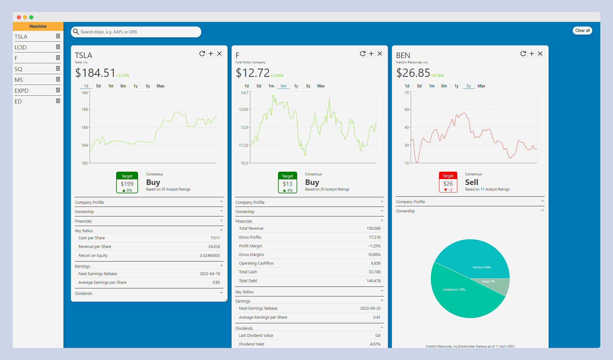

# Spring Rain - Market Research Hub

This app allows you to search for publicly traded companies accessing the [Yahoo Finance API](https://rapidapi.com/apidojo/api/yh-finance) 
in exchanges such as the New York Stock Exchange or Nasdaq, as well as popular indexes as the DOW or S&P 500. Enter a ticker symbol, e.g. META to 
retrieve the financial data, analyze historical price movements as well as Analyst predictions for the future, add a 
company to your watchlist and compare them to competitors.  

The Frontend was written using the React framework and bootstrapped with [Create React App](https://github.com/facebook/create-react-app).

The Backend is written in Node.js and hosted by [Netlify](https://www.netlify.com/) using [Netlify Serverless Functions](https://www.netlify.com/blog/intro-to-serverless-functions), 
to safely store the API-Key while accessing the Yahoo Finance API.

## Live Demo

Try out the [Live Demo](https://springrainhub.com/)!
\
\

\

### Questions & Troubleshooting

Be aware that this app only allows 5 API calls per second. If the company you are looking for cannot be found, you have 
likely made a spelling mistake in the ticker name. Also make sure the company is publicly traded at one of the markets available in 
Yahoo Finance.

For any other problems or inputs do not hesitate to create an Issue on GitHub and I will follow up on it!
